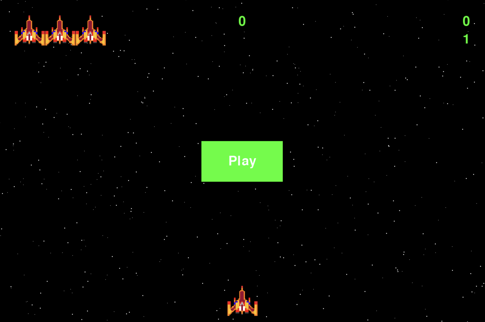
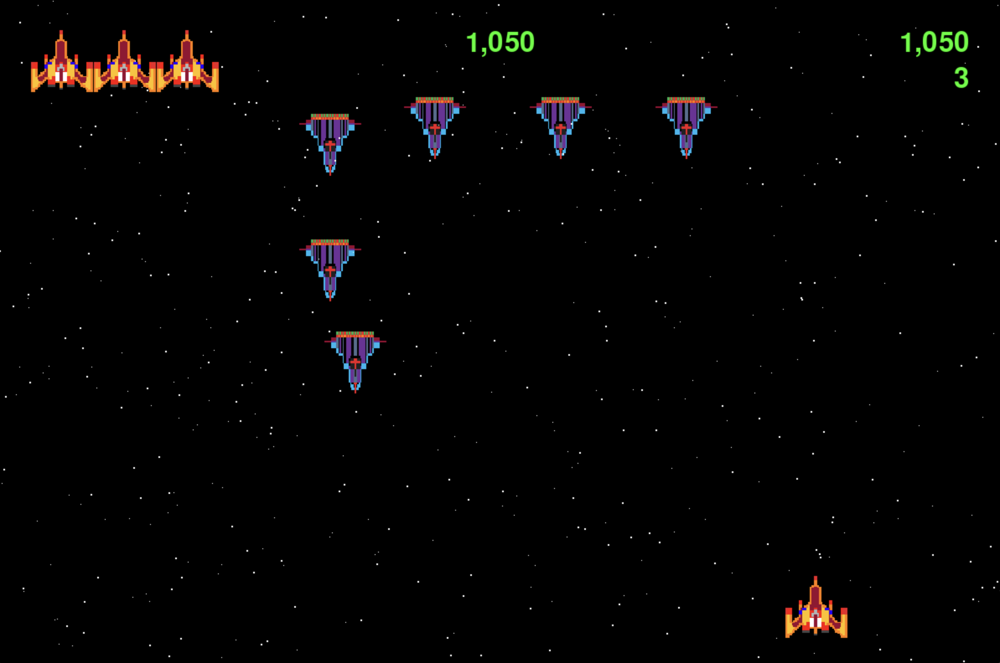

# Project Overview

A space shooter game designed to provide an entertaining experience where players aim to achieve high scores by destroying alien ships and avoid incoming enemy bullets.

## Galactic Defender

## How To Play The Game

Shoot all the enemy ships down to progress and accumulate as much points as possible.

### Create and Activate Virtual Environment

```bash
# Create Virtual Environment
python3 -m venv .venv

# Activate Virtual Environment (Linux/Mac)
source .venv/bin/activate

# Activate Virtual Environment (Windows)
.venv\Scripts\activate

# To Deactive Virtual Environment
source deactivate
```

### Install Depedencies

```bash
# Install the current requirements
pip3 install -r requirements.txt

# If you update dependencies
pip3 freeze > requirements.txt
```

### Start Game

```bash
python main.py
```

### Controls

1. Press `Q` to Quit
2. Press or Hold `spacebar` to shoot
3. &larr; &uarr; &rarr; &darr; to Move

# Preview




